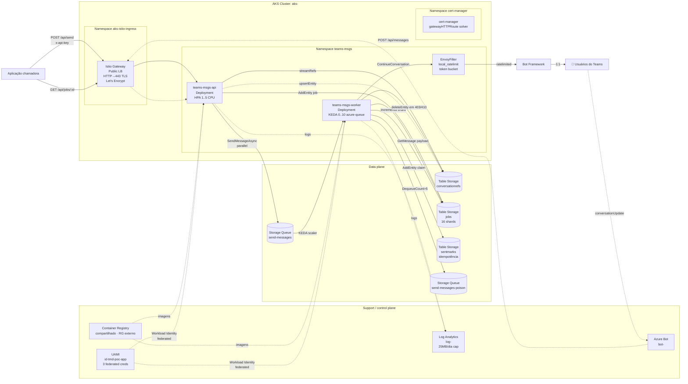
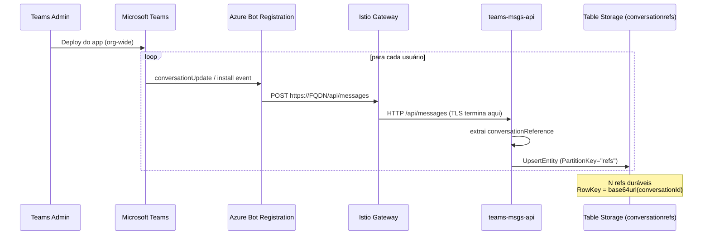
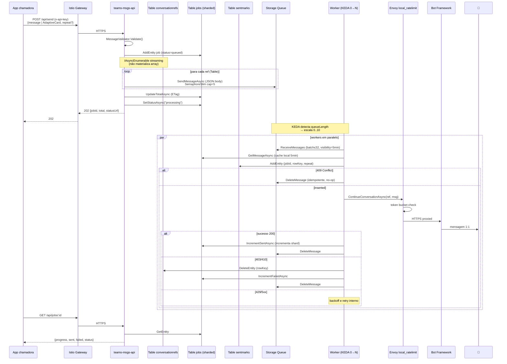
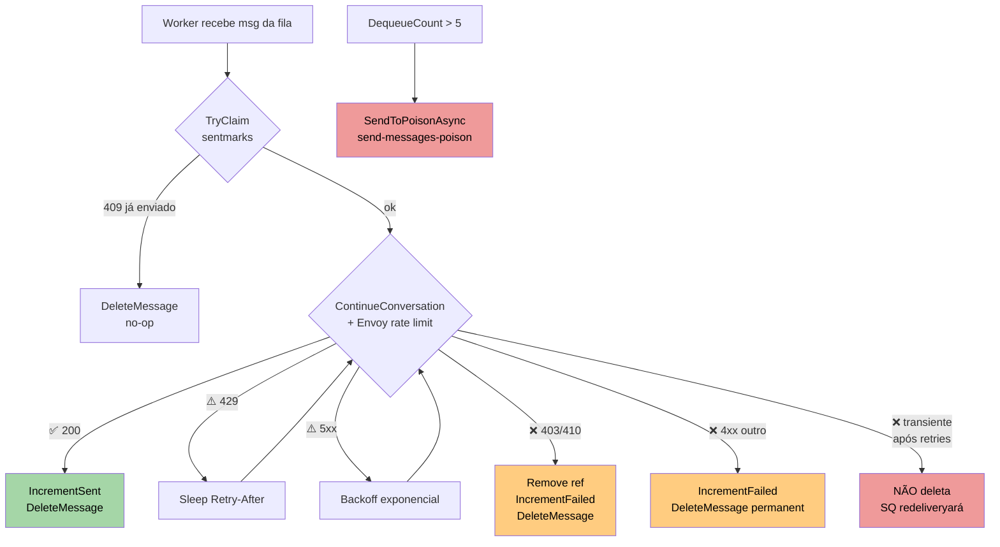

# 📨 Teams Proactive Messaging — .NET 8 / AKS / Storage Queue

[](https://orcid.org/0009-0006-0765-4201)
[](LICENSE)
[](#)
[](#)
[](#)
[](https://github.com/EdneiMonteiro/teams_msgs_dotnet/commits)

Port em **.NET 8** da demo [`teams_msgs`](https://github.com/EdneiMonteiro/teams_msgs) (Node/TS), com substituição de componentes Azure: **Storage Queue** no lugar do Service Bus, **Table Storage** no lugar do Redis, **AKS** + **KEDA** + **Istio** no lugar do ACA. Mesma proposta: envio de mensagens proativas 1:1 em massa via Microsoft Teams (Bot Framework), respeitando rate limits.

> ⚠️ Este repositório é uma **demo / prova de conceito**. Antes de usar em produção, revise: segurança, escalabilidade, observabilidade, custos e conformidade. Veja [DISCLAIMER.md](./DISCLAIMER.md) e [SUPPORT.md](./SUPPORT.md).

---

## ✨ Highlights da versão atual

| Capacidade | Como |
|---|---|
| 🚀 Fan-out assíncrono | Streaming generator das refs (Table Storage) + paralelismo controlado por `SemaphoreSlim` no enqueue da Storage Queue |
| 🎯 Rate limit | **Istio EnvoyFilter local_ratelimit** no sidecar outbound do worker (token bucket no Envoy, por pod). Substitui o Lua bucket Redis do repo original |
| 🎴 Adaptive Cards | `POST /api/send` aceita texto **ou** `{ type:"AdaptiveCard", content:<card> }` |
| 🔁 Idempotência | Tabela `sentmarks` com insert-or-conflict — substitui a dedup nativa de `messageId` do Service Bus |
| 📊 Counters sem Redis (sharded) | Contador do job dividido em **16 shards** (`jobId_sN`) no Table Storage, somados na leitura — elimina a contenção de `ETag` sob alta concorrência de workers |
| 🩺 Health probes | `/healthz` (liveness) + `/readyz` (Storage Table + Storage Queue + Jobs table) |
| 🔒 Hardened auth | `x-api-key` com `CryptographicOperations.FixedTimeEquals` |
| 🔑 Sem connection strings | Workload Identity (federated credentials) em 3 SAs: `teams-msgs-api`, `teams-msgs-worker`, `kube-system:keda-operator` |
| 🛡️ HTTPS Let's Encrypt | cert-manager 1.20 + Gateway API + solver `gatewayHTTPRoute` (sem NGINX) |
| 🧪 Testes | xUnit (26 testes) cobrindo validator, retry, idempotency, safe row key |
| 🏗️ IaC | Bicep subscription-scope (AKS + Istio + KEDA + WI + Storage + Log Analytics + Bot); ACR compartilhado em RG externo |
| 🚢 Deploy | Helm chart com KEDA `ScaledObject` (`azure-queue`), HPA CPU para API, EnvoyFilter para rate limit |

---

## Por que essa arquitetura?

Em cenários de comunicação corporativa em massa via Teams, as alternativas comumente tentadas têm comportamentos diferentes:

| Abordagem | Realidade |
|---|---|
| **Power Automate** | Limites por licença e conector, não projetado para processamento massivo; pode sofrer throttling e latência. |
| **Microsoft Graph** | Possui throttling multi-nível (app, tenant, user); adequado para integração, não para broadcast massivo. |
| **Bot Framework** | Canal nativo para notificações e proactive messaging; melhor suporte para escala, com rate limits dinâmicos. |

Esta demo **não burla rate limits** — usa o canal certo. O envio depende do Teams App estar instalado para cada usuário (org-wide via Admin Center), o que faz o bot capturar uma `conversationReference` por usuário e usá-la depois para mandar mensagens 1:1 sem nova interação.

---

## Diferenças vs. o repo original (TypeScript)

Mesma lógica, componentes Azure diferentes:

| Camada | `teams_msgs` (TS) | `teams_msgs_dotnet` |
|---|---|---|
| Runtime | Node 20 + TypeScript | **.NET 8 LTS** (ASP.NET Core Minimal API + Worker Service) |
| Fila | Azure Service Bus (queue `send-messages`) | **Azure Storage Queue** |
| Cache / counters / rate-limit | Azure Cache for Redis (HMSET + HINCRBY + Lua bucket) | **Table Storage (counter sharding) + Istio EnvoyFilter (local_ratelimit)** |
| Compute | Azure Container Apps + KEDA | **AKS + KEDA azure-queue + HPA CPU** |
| Ingress | (não tinha — ACA built-in) | **AKS managed Istio + Gateway API + cert-manager + Let's Encrypt** |
| Auth ao Storage | Connection string | **Workload Identity** (federated credentials) |
| Idempotência | `messageId` dedup do SB | Tabela `sentmarks` (insert-or-conflict) |
| DLQ | SB DLQ automática | `send-messages-poison` (manual, após `DequeueCount > 5`) |
| Limite por msg | 256 KB (SB) | **64 KB** (Storage Queue) — AdaptiveCards grandes fora do escopo |
| IaC | (livre escolha) | Bicep subscription-scope |
| CD | (livre escolha) | Helm chart + GitHub Actions OIDC |

---

## Índice

- [Arquitetura](#arquitetura)
- [Componentes Azure](#componentes-azure)
- [Fluxo de funcionamento](#fluxo-de-funcionamento)
- [Endpoints da API](#endpoints-da-api)
- [Rate limit — Envoy local_ratelimit](#rate-limit--envoy-local_ratelimit)
- [Idempotência sem dedup nativa](#idempotência-sem-dedup-nativa)
- [Counters sem Redis (sharding)](#counters-sem-redis-sharding)
- [Segurança](#segurança)
- [Estrutura do projeto](#estrutura-do-projeto)
- [Testes](#testes)
- [Como iniciar (dev local)](#como-iniciar-dev-local)
- [Deploy em Azure](#deploy-em-azure)
- [Deploy do Teams App](#deploy-do-teams-app)
- [Load test](#load-test)
- [Troubleshooting](#troubleshooting)

---

## Arquitetura

### Visão geral



**Princípios:**

- **Table Storage = caminho quente E durabilidade**: counters via **sharding** (16 shards por job, somados na leitura), index ativo de refs (varredura por partition), payload da mensagem cacheado por job, **idempotência** via insert-or-conflict.
- **Storage Queue = fan-out**: barata, simples, sem dedup nativa (compensada por `sentmarks`). Sem DLQ nativa (compensada por `send-messages-poison`). Limite de 64 KB por msg.
- **Istio Gateway + cert-manager = entrada única**: HTTPS terminado pelo gateway com cert Let's Encrypt automático. Substitui NGINX Ingress completamente.
- **AKS = compute**: API com `HPA` por CPU + Worker com `KEDA azure-queue` 0→10. Control plane Free tier; 2 nodes `Standard_D2s_v5`.
- **Workload Identity = sem secrets**: cada SA federado ao mesmo UAMI; SDK Azure usa `DefaultAzureCredential` para autenticar no Storage data plane.

### Detalhe — caminho de uma mensagem

```mermaid
flowchart LR
    M1["/api/send<br/>POST"] --> M2["MessageValidator"]
    M2 -->|"texto / card"| M3["TableJobTracker.CreateAsync<br/>AddEntity job (total=0)"]
    M3 --> M4["for each ref<br/>streamRefs Table"]
    M4 --> M5["semaphoreSlim.Wait<br/>(concurrency=5)"]
    M5 --> M6["queue.SendMessageAsync<br/>(JSON body)"]
    M6 --> M7["UpdateTotalAsync<br/>(reconcilia total)"]
    M7 --> M8["KEDA escala worker<br/>0→10 réplicas"]
    M8 --> M9["BackgroundService<br/>ReceiveMessages (batch≤32)"]
    M9 --> M10["SentMarkStore.TryClaim<br/>AddEntity → 409=já enviado"]
    M10 -->|claimed| M11["CloudAdapter.ContinueConversation"]
    M10 -.->|409| M9
    M11 --> M12["Envoy local_ratelimit<br/>token bucket"]
    M12 --> M13{"outcome"}
    M13 -->|"200"| M14["IncrementSentAsync<br/>incrementa shard"]
    M13 -->|"403/410"| M15["RemoveByRowKeyAsync<br/>IncrementFailedAsync"]
    M13 -->|"429/5xx"| M11
    style M3 fill:#FFE082,color:#000
    style M10 fill:#A5D6A7,color:#000
    style M12 fill:#FFAB91,color:#000
    style M14 fill:#A5D6A7,color:#000
    style M15 fill:#EF9A9A,color:#000
```



---

## Componentes Azure

| Recurso | Nome na demo | SKU | Função |
|---|---|---|---|
| App Registration | associado ao Azure Bot | Free | Identidade do bot (SingleTenant) |
| Azure Bot | `bot-<seu-bot>` | F0 | Registro Bot Framework + canal Teams |
| AKS | `aks-<seu-cluster>` | Base / Free control plane | Cluster gerenciado; nodes `Standard_D2ds_v5` x2, OS disk efêmero |
| AKS add-on KEDA | nativo do cluster | — | Escala worker pela profundidade da Storage Queue |
| AKS add-on Istio | `mesh enable` + `mesh enable-ingress-gateway` | — | Service mesh + Istio Gateway externo para ingress |
| Gateway API CRDs | v1.2.0 | — | Padrão Kubernetes Gateway (substitui Ingress) |
| cert-manager | jetstack/cert-manager v1.20.2 | — | Let's Encrypt automático via `gatewayHTTPRoute` solver |
| Storage Account | `sttmd…` | Standard_LRS | Tables: `conversationrefs`, `jobs`, `sentmarks`. Queues: `send-messages`, `send-messages-poison` |
| Container Registry | compartilhado (RG externo) | Basic | Imagens API + Worker (fora do RG da PoC) |
| Log Analytics | `log-<seu-workspace>` | PerGB2018 (cap 25 MB/dia) | Container Insights do AKS |
| User-Assigned MI | `id-tmd-poc-app` | — | UAMI federada a 3 SAs (api, worker, keda-operator) |

---

## Fluxo de funcionamento

### Fase 1 — Registro de usuários (passivo)



### Fase 2 — Disparo do comunicado



### Fase 3 — Tratamento de erros



---

## Endpoints da API

| Método | Path | Auth | Descrição |
|---|---|---|---|
| POST | `/api/messages` | Bot Framework token (JWT) | Endpoint do Bot Framework (configure como Messaging Endpoint no Azure Bot) |
| POST | `/api/send` | `x-api-key` | Enfileira N mensagens na Storage Queue e retorna `202 Accepted` |
| GET | `/api/jobs/{id}` | `x-api-key` | Progresso do job (Table Storage) |
| GET | `/api/status` | `x-api-key` | Contagem de usuários registrados |
| GET | `/healthz` | — | Liveness simples |
| GET | `/readyz` | — | Readiness (Table Storage + Storage Queue acessíveis via Workload Identity) |

### `POST /api/send`

Aceita **texto** ou **Adaptive Card**.

**Texto:**
```http
POST /api/send
Content-Type: application/json
x-api-key: <API_KEY>

{
  "message": "📢 Comunicado importante para todos os colaboradores!",
  "repeat": 1
}
```

**Adaptive Card:**
```http
POST /api/send
Content-Type: application/json
x-api-key: <API_KEY>

{
  "message": {
    "type": "AdaptiveCard",
    "content": {
      "type": "AdaptiveCard",
      "version": "1.5",
      "body": [
        { "type": "TextBlock", "size": "Medium", "weight": "Bolder", "text": "Atualização" },
        { "type": "TextBlock", "text": "Conteúdo da mensagem.", "wrap": true }
      ],
      "actions": [
        { "type": "Action.OpenUrl", "title": "Saiba mais", "url": "https://exemplo.com" }
      ]
    }
  }
}
```

| Campo | Tipo | Obrigatório | Descrição |
|---|---|---|---|
| `message` | string \| object | sim | Texto OU `{ type:"AdaptiveCard", content:<card json> }` |
| `repeat` | int | não | Cópias por usuário (default `1`). Útil para testes controlados de stress; use com cautela. |

```json
HTTP/1.1 202 Accepted
{
  "jobId": "fde42c3cc1754f3c8ade21c4555797e2",
  "refs": 1,
  "repeat": 1,
  "total": 1,
  "enqueued": 1,
  "drops": 0,
  "messageType": "text",
  "status": "queued",
  "statusUrl": "/api/jobs/fde42c3cc1754f3c8ade21c4555797e2"
}
```

> ⚠️ **`repeat` multiplica `refs × repeat`** mensagens reais para o Bot Framework. Use com cuidado em produção — útil principalmente para load testing.
>
> O `202 Accepted` é retornado **depois** que a API termina o streaming das referências e enfileira as mensagens. O HTTPRoute do Istio Gateway tem `timeouts.request: 600s` para suportar fan-outs grandes; ainda assim, o padrão de produção recomendado é mover o fan-out para um `BackgroundService` + `Channel<T>` e retornar 202 imediatamente.

### `GET /api/jobs/{id}`

```json
{
  "jobId": "fde42c3cc1754f3c8ade21c4555797e2",
  "message": "📢 Comunicado importante para todos os colaboradores!",
  "messageType": "text",
  "total": 1,
  "sent": 1,
  "failed": 0,
  "status": "completed",
  "progress": 100,
  "createdAt": "2026-06-11T07:54:04+00:00",
  "updatedAt": "2026-06-11T07:54:13+00:00",
  "errors": []
}
```

| `status` | Significado |
|---|---|
| `queued` | Job criado, mensagens sendo enfileiradas |
| `processing` | Workers estão enviando |
| `completed` | Todas processadas (`sent + failed = total`) |
| `failed` | Falha no enqueue (recebido em 503 da API) |

---

## Rate limit — Envoy local_ratelimit

No repo original (TS), o rate-limit é um **token bucket Lua atômico no Redis**, global entre todas as réplicas. Aqui, ele saiu da app e foi para o **sidecar Envoy injetado pelo Istio**, via `EnvoyFilter`:

```yaml
# deploy/helm/teams-msgs/templates/envoyfilter-ratelimit.yaml
spec:
  workloadSelector:
    labels:
      app.kubernetes.io/component: worker
  configPatches:
    - applyTo: HTTP_FILTER
      match:
        context: SIDECAR_OUTBOUND
      patch:
        value:
          name: envoy.filters.http.local_ratelimit
          typed_config:
            token_bucket:
              max_tokens: 50
              tokens_per_fill: 50
              fill_interval: 1s
```

**Trade-off**: o token bucket é **por pod**. Limite global aproximado = `maxReplicaCount × tokensPerFill / fillInterval`.

Para rate limit verdadeiramente global cross-pod, seria preciso voltar a usar um backend compartilhado (Redis externo ou `RateLimitService` do Envoy). Para PoC, a aproximação por pod é aceita.

| Parâmetro (values.yaml) | Default | Significado |
|---|---:|---|
| `worker.rateLimit.enabled` | `true` | Liga/desliga o EnvoyFilter |
| `worker.rateLimit.maxTokens` | `50` | Burst máximo por pod |
| `worker.rateLimit.tokensPerFill` | `50` | Tokens adicionados por intervalo |
| `worker.rateLimit.fillInterval` | `1s` | Intervalo de refill |

---

## Idempotência sem dedup nativa

O Service Bus do repo original tem `messageId` deduplication (quando configurado em Standard/Premium). A Storage Queue **não tem** equivalente. A substituição:

```csharp
// Antes do envio real ao Bot Framework:
var claimed = await sentMarkStore.TryClaimAsync(jobId, refRowKey, repeatIndex, ct);
if (!claimed) {
    // 409 Conflict → outra réplica já entregou. Apenas remove da fila.
    await receiver.CompleteAsync(message, ct);
    return;
}
// Procede com ContinueConversationAsync...
```

Tabela `sentmarks`:
- `PartitionKey` = `jobId`
- `RowKey` = `{md5_hex(refRowKey)}_r{repeatIndex}` (estável e curto)
- `AddEntity` falha com 409 se já existe → idempotência efetiva

Vantagem: funciona com qualquer backend de fila (Storage Queue, Service Bus, RabbitMQ).
Custo: 1 escrita extra em Table Storage por mensagem (~0,5 ms p50).

---

## Counters sem Redis (sharding)

No repo original, contadores de job (`sent`, `failed`, `total`) usavam `HINCRBY` do Redis — atômico e barato.

Aqui, o contador é uma entidade **"quente"**: sob alta concorrência de workers KEDA, um registro único sofre forte contenção de `ETag` (`412 Precondition Failed`). Para escalar, `TableJobTracker` **distribui o contador em 16 shards** — `sent`/`failed` ficam em sub-entidades `jobId_s0..jobId_s15`. Cada incremento atualiza **um shard aleatório** (contenção ~16× menor) e a leitura (`GetAsync`) **soma os shards em paralelo**. O `status` (`completed`) é derivado on-read de `(Σsent + Σfailed) ≥ total`.

```csharp
// incremento: só um shard
var rowKey = $"{jobId}_s{Random.Shared.Next(ShardCount)}";   // '_' — Table Storage proíbe '#' em RowKey
await pipeline.ExecuteAsync(async token => {
    try {
        var e = (await table.GetEntityAsync<TableEntity>(pk, rowKey, ct: token)).Value;
        e[field] = (e.GetInt64(field) ?? 0) + 1;
        await table.UpdateEntityAsync(e, e.ETag, TableUpdateMode.Merge, token);
    } catch (RequestFailedException ex) when (ex.Status == 404) {
        await table.AddEntityAsync(new TableEntity(pk, rowKey) { [field] = 1L }, token);   // 1º incremento do shard
    }
});
// leitura: GetAsync soma jobId_s0..s15 (Task.WhenAll) → sent/failed totais
```

**Histórico**: a 1ª versão fazia `read-modify-write` num registro único com retry de `ETag` (Polly). Resolvia a *correção*, mas a entidade quente limitava a *vazão* — o teste de 1.000 fechava 100%, mas o de 50 mil (10 workers) travava por contenção e mandava mensagens para a poison queue. O **sharding eliminou a contenção** (a antiga limitação acima de ~500 incrementos simultâneos no mesmo `jobId`).

---

## Segurança

- `POST /api/send`, `GET /api/jobs/{id}`, `GET /api/status` exigem header `x-api-key` quando `Api:ApiKey` está definida.
- Comparação com `CryptographicOperations.FixedTimeEquals` (não vulnerável a timing attacks).
- Em **dev local**, deixar `Api:ApiKey` vazia desliga a checagem (log de warning ao iniciar).
- **Workload Identity** elimina connection strings: pods da api e worker autenticam no Storage data plane via `DefaultAzureCredential` → JWT federado emitido pelo Entra para o UAMI. O UAMI tem as roles `Storage Table Data Contributor` + `Storage Queue Data Contributor`.
- **TLS terminado no Istio Gateway** com cert Let's Encrypt válido (auto-renew via cert-manager).
- Secrets sensíveis (`Bot:AppPassword`, `Api:ApiKey`) ficam em `Secret` do Kubernetes; recomenda-se mover para Azure Key Vault + CSI driver em produção.

### Roles RBAC criadas pelo Bicep

| Identidade | Role | Scope |
|---|---|---|
| UAMI `id-tmd-poc-app` | Storage Table Data Contributor | Storage Account |
| UAMI `id-tmd-poc-app` | Storage Queue Data Contributor | Storage Account |
| AKS kubelet identity | AcrPull | ACR |

### Federated identity credentials (UAMI ↔ SA do K8s)

| Name | Subject | Para |
|---|---|---|
| `fed-api` | `system:serviceaccount:teams-msgs:teams-msgs-api` | Pod da API acessar Storage |
| `fed-worker` | `system:serviceaccount:teams-msgs:teams-msgs-worker` | Pod do worker acessar Storage |
| `fed-keda` | `system:serviceaccount:kube-system:keda-operator` | KEDA scaler ler queue length |

---

## Estrutura do projeto

```
teams_msgs_dotnet/
├── src/
│   ├── TeamsMsgs.Api/                # ASP.NET Core Minimal API
│   │   ├── Program.cs                # bootstrap + endpoints
│   │   ├── Auth/                     # ApiKeyEndpointFilter (FixedTimeEquals)
│   │   ├── Bot/                      # BotRegistration (CloudAdapter)
│   │   ├── Endpoints/                # Bot, Send, Jobs, Health
│   │   └── Hosting/                  # DI helpers
│   ├── TeamsMsgs.Worker/             # Worker Service (BackgroundService)
│   │   ├── Program.cs                # bootstrap
│   │   └── Hosting/
│   │       ├── QueueConsumerService.cs  # consome SQ → ContinueConversation
│   │       └── BotHttpStatus.cs         # extrai status + Retry-After
│   └── TeamsMsgs.Shared/             # biblioteca compartilhada
│       ├── Validation/MessageValidator.cs
│       ├── Configuration/Options.cs
│       ├── Azure/AzureClientFactory.cs  # TableClient/QueueClient com MI ou conn string
│       ├── Storage/ConversationRefStore.cs
│       ├── Jobs/TableJobTracker.cs   # sharded counters
│       ├── Jobs/SentMarkStore.cs     # idempotência
│       ├── Queueing/StorageSendQueue.cs
│       ├── Sending/SendWithRetry.cs
│       └── Bot/ProactiveBot.cs
├── tests/
│   └── TeamsMsgs.Tests/              # xUnit (26 testes)
│       ├── MessageValidatorTests.cs  # 10 — validador (text/AdaptiveCard)
│       ├── SendWithRetryTests.cs     # 10 — retry (429/5xx/403/410/4xx)
│       └── RowKeyTests.cs            # 6 — safe row key, md5 sentmark key
├── deploy/
│   ├── bicep/
│   │   ├── main.bicep                # orchestrator subscription-scope
│   │   ├── main.bicepparam
│   │   └── modules/
│   │       ├── storage.bicep
│   │       ├── acr-rbac.bicep        # AcrPull no ACR compartilhado (RG externo)
│   │       ├── aks.bicep
│   │       ├── loganalytics.bicep
│   │       ├── identity.bicep
│   │       ├── federation.bicep
│   │       ├── federation-keda.bicep
│   │       ├── rbac.bicep
│   │       └── bot.bicep
│   ├── helm/teams-msgs/              # chart: api, worker, configmap, secret,
│   │                                 # serviceaccount, scaledobject, hpa,
│   │                                 # envoyfilter-ratelimit, namespace
│   ├── istio-gateway.yaml            # Gateway + HTTPRoute (Gateway API)
│   ├── clusterissuer-gw.yaml         # ClusterIssuer Let's Encrypt
│   └── istio-cert.yaml               # Certificate request
├── docker/
│   ├── Dockerfile.api                # mcr.microsoft.com/dotnet/aspnet:8.0-alpine
│   └── Dockerfile.worker             # mcr.microsoft.com/dotnet/aspnet:8.0-alpine
├── manifest/
│   ├── manifest.json                 # template Teams App
│   ├── color.png                     # 192×192
│   ├── outline.png                   # 32×32
│   ├── build.ps1                     # gera build/teams-msgs-dotnet-app.zip
│   └── build/                        # .zip ignorado pelo git
├── load_test/
│   ├── run-50k.js                    # insere refs fictícias + 1 job + limpeza
│   └── package.json
├── .github/workflows/
│   ├── ci.yml                        # build+test+lint (PR)
│   └── cd.yml                        # OIDC + ACR build + helm upgrade
├── docs/
│   ├── architecture.md
│   ├── deploy.md
│   └── troubleshooting.md
├── TeamsMsgs.sln
├── Directory.Build.props             # net8.0, nullable, NoWarn pedantes
├── Directory.Packages.props          # central package management
├── DISCLAIMER.md
├── SUPPORT.md
├── CITATION.cff
├── LICENSE
└── README.md
```

---

## Testes

```bash
dotnet test
```

```
Passed!  - Failed: 0, Passed: 26, Skipped: 0, Total: 26, Duration: 25 ms
```

| Suíte | Cobertura |
|---|---|
| `MessageValidatorTests` (10) | null, string vazia, whitespace, AdaptiveCard válido/inválido, número, array |
| `SendWithRetryTests` (10) | 200/429/403/410/400/500/transient/Retry-After header, retry-then-success |
| `RowKeyTests` (6) | `ToSafeRowKey` (base64url, determinístico), `BuildRowKey` do SentMarkStore (md5 hex + suffix) |

Os helpers `MessageValidator`, `SendWithRetry`, `SentMarkStore.BuildRowKey` e `ConversationRefStore.ToSafeRowKey` foram **extraídos** para classes/funções puras, permitindo unit tests sem mocks pesados.

---

## Como iniciar (dev local)

```bash
git clone git@github.com:EdneiMonteiro/teams_msgs_dotnet.git
cd teams_msgs_dotnet

# Restore + testes
dotnet test

# Rodar API local — exige Storage Account configurado
dotnet run --project src/TeamsMsgs.Api
# default: http://localhost:5000  (ASPNETCORE_URLS sobrescreve)

# Worker local
dotnet run --project src/TeamsMsgs.Worker
```

`appsettings.json` aceita `Storage:ConnectionString` (dev) ou `Storage:TableServiceUri` + `Storage:QueueServiceUri` (prod com `DefaultAzureCredential` via `az login`).

Para expor o `/api/messages` ao Bot Framework em dev:
```bash
# Em outro terminal:
ngrok http 5000
# Atualize Messaging Endpoint do Azure Bot para https://<ngrok>/api/messages
```

---

## Deploy em Azure

Passo-a-passo detalhado em [`docs/deploy.md`](./docs/deploy.md). Resumo:

```bash
# 1) Cria App Registration (precisa do tenant Entra)
APP_ID=$(az ad app create --display-name "teams-msgs-dotnet-bot" \
  --sign-in-audience AzureADMyOrg --query appId -o tsv)
az ad sp create --id "$APP_ID"
PWD=$(az ad app credential reset --id "$APP_ID" --append \
  --display-name "k8s" --years 1 --query password -o tsv)

# 2) Bicep — cria RG + Storage + Log Analytics + UAMI + AKS + federations
#     + Azure Bot (se botMsaAppId for fornecido); AcrPull no ACR compartilhado
export SHARED_ACR_NAME=<acr-compartilhado>; export SHARED_ACR_RG=<rg-do-acr>
az deployment sub create \
  --location brazilsouth \
  --template-file deploy/bicep/main.bicep \
  --parameters deploy/bicep/main.bicepparam

# 3) AKS add-ons (Istio Gateway externo + Gateway API CRDs)
az aks mesh enable-ingress-gateway -g rg-<seu-rg> -n aks-<seu-cluster> \
  --ingress-gateway-type external
az aks get-credentials -g rg-<seu-rg> -n aks-<seu-cluster>
kubectl apply -f \
  https://github.com/kubernetes-sigs/gateway-api/releases/download/v1.2.0/standard-install.yaml

# 4) cert-manager
helm repo add jetstack https://charts.jetstack.io
helm upgrade --install cert-manager jetstack/cert-manager \
  -n cert-manager --create-namespace --set crds.enabled=true --wait

# 5) Atribui DNS label ao Public IP do Istio Gateway
MC_RG=$(az aks show -g rg-<seu-rg> -n aks-<seu-cluster> --query nodeResourceGroup -o tsv)
IP_NAME=$(az network public-ip list -g $MC_RG \
  --query "[?contains(name,'kubernetes')] | [0].name" -o tsv)
az network public-ip update -g $MC_RG -n $IP_NAME --dns-name teams-msgs-dotnet

# 6) Aplica Gateway/HTTPRoute/ClusterIssuer/Certificate
kubectl apply -f deploy/clusterissuer-gw.yaml \
              -f deploy/istio-gateway.yaml \
              -f deploy/istio-cert.yaml

# 7) Build das imagens no ACR compartilhado (resolve por nome, RG externo)
ACR=<acr-compartilhado>
az acr build -r $ACR --image teams-msgs/api:0.1.0 -f docker/Dockerfile.api .
az acr build -r $ACR --image teams-msgs/worker:0.1.0 -f docker/Dockerfile.worker .

# 8) Helm: cria values-poc.yaml a partir do template e dos outputs do Bicep
cp deploy/helm/teams-msgs/values-poc.yaml.template deploy/helm/teams-msgs/values-poc.yaml
# preencha: image.registry, workloadIdentity.uamiClientId, storage.*ServiceUri,
#           bot.appId, bot.appPassword, api.apiKey

helm upgrade --install teams-msgs deploy/helm/teams-msgs \
  -n teams-msgs --create-namespace \
  -f deploy/helm/teams-msgs/values.yaml \
  -f deploy/helm/teams-msgs/values-poc.yaml

# 9) Atualiza Messaging Endpoint do Azure Bot
az bot update -g rg-<seu-rg> -n bot-<seu-bot> \
  --endpoint "https://teams-msgs-dotnet.brazilsouth.cloudapp.azure.com/api/messages"
```

> Stack validado em ambiente PoC (região `brazilsouth`). Outputs do Bicep e os passos completos estão em [`docs/deploy.md`](./docs/deploy.md).

---

## Deploy do Teams App

1. Gere o pacote: `pwsh ./manifest/build.ps1 -AppId <APP_ID> -Fqdn <FQDN>` → cria `manifest/build/teams-msgs-dotnet-app.zip` (ignorado pelo `.gitignore`).
2. Suba em **Teams Admin Center → Manage apps → Upload custom app**.
3. **Setup policies → Global → Installed apps → Add apps** (org-wide).
4. Propagação org-wide leva 24–48h. Para testes imediatos, instale manualmente em **Apps → Built for your org**.

---

## Load test

```bash
cd load_test
npm install

$env:BOT_URL = "https://teams-msgs-dotnet.brazilsouth.cloudapp.azure.com"
$env:API_KEY = "<api-key>"
$env:STORAGE_ACCOUNT = "sttmd..."     # autentica via az login + DefaultAzureCredential
node run-50k.js --refs 5000           # parâmetros válidos: --refs N, --skip-seed, --cleanup
```

O script:
1. Insere `N` referências **fictícias** na tabela `conversationrefs` (clonando 1 referência real, com `conversationId` falso → o envio real retorna `BadRequest`, esperado)
2. Dispara `POST /api/send`
3. Consulta `/api/jobs/{id}` a cada 2 s até `completed`
4. Gera `load_test/report.json` com vazão e tempos
5. Remove as referências fictícias ao final

> Para receber **N mensagens reais** no seu Teams (em vez de testar o pipeline), use `repeat: N` no `POST /api/send` em vez do teste de carga.

Resultado de referência validado neste cluster:
- **201 mensagens em 35 s** com 1 pod de worker = **354 msg/min**
- KEDA escalou de 0 para 1 réplica em ~6 s
- Vazão projetada para 50 mil mensagens com 10 workers: **~15 min** (~3500 msg/min agregado)

---

## Troubleshooting

| Sintoma | Causa | Solução |
|---|---|---|
| `Authorization denied` no envio | Service Principal ausente no tenant alvo | `az ad sp create --id <app-id>` |
| `401 Unauthorized` em `/api/send`, `/api/jobs`, `/api/status` | `x-api-key` faltando ou divergente | Veja `Api:ApiKey` na ConfigMap/Secret do Helm |
| `401` em `/api/messages` (Bot Framework) | App Registration sem credencial OU `MicrosoftAppPassword` errado no Secret | Reseta com `az ad app credential reset` e atualiza `bot.appPassword` no `values-poc.yaml` |
| `403 Forbidden AuthorizationPermissionMismatch` no Table Storage | Pod sem RBAC data plane | Bicep `rbac.bicep` deve atribuir `Storage Table Data Contributor` ao UAMI |
| `AADSTS700213: No matching federated identity` no KEDA | Federated credential do `keda-operator` ausente | Aplicar `deploy/bicep/modules/federation-keda.bicep` |
| Workers em `CrashLoopBackOff` com "No frameworks were found" | `Dockerfile.worker` usando `dotnet/runtime` em vez de `dotnet/aspnet` (Bot integration precisa do ASP.NET runtime) | Usar `mcr.microsoft.com/dotnet/aspnet:8.0-alpine` |
| `Unable to activate type 'CloudAdapter'. Constructors are ambiguous` | DI sem factory explícita do CloudAdapter | Registrar via `sp => new CloudAdapter(sp.GetRequiredService<BotFrameworkAuthentication>(), …)` em vez de `AddSingleton<CloudAdapter>()` |
| `504 Gateway Timeout` em `/api/send` com 50k+ refs | Timeout default 60s do ingress | `HTTPRoute.spec.rules[].timeouts.request: 600s` (já aplicado no chart) OU refatorar para BackgroundService + Channel |
| Total = 0 em job grande | API cancelou o fan-out porque o cliente desconectou (504) | Mesmo fix do anterior. Em dev rápido: ignorar `RequestAborted` no `/api/send` handler |
| `/readyz` retorna 503 | Storage Account inacessível ou Workload Identity sem role | Cheque o RBAC do UAMI e a federated credential `fed-api` |
| `OverQuota` no Log Analytics | Daily cap atingido (configurado em 25 MB/dia) | Subir cap com `az monitor log-analytics workspace update --quota X` ou reduzir log level para `Warning` |
| KEDA escala mas mensagens não somem da fila | Pod do worker em crash | `kubectl -n teams-msgs logs deployment/teams-msgs-worker --tail=50` |
| `Bot Service: Agent.MessagesUrl must not be an IP address` | Bicep `bot.bicep` recebeu URL com IP cru | Configure DNS label no Public IP do Istio Gateway antes do deploy do módulo bot |
| Job travado em `processing` indefinidamente | Mensagens em poison ou refs órfãs | `kubectl -n teams-msgs logs deployment/teams-msgs-worker` e/ou `az storage message peek -q send-messages-poison` |

---

## Suporte e Aviso Legal

- Sem SLA nem suporte oficial. Veja [SUPPORT.md](./SUPPORT.md).
- Uso sujeito a [DISCLAIMER.md](./DISCLAIMER.md).
- **Não afiliado nem endossado pela Microsoft.** Marcas usadas apenas para descrição.
