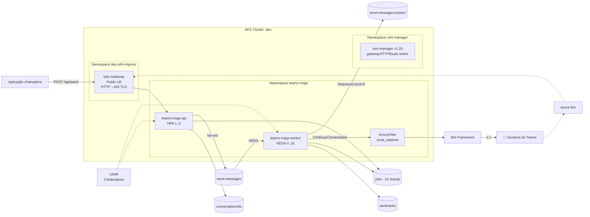

# Arquitetura

Documento detalhado da stack `.NET 8 + AKS + Storage Queue + Table Storage + Istio + Workload Identity`.

## Visão geral



## Componentes por camada

### Ingress / TLS

- **AKS managed Istio mesh** (`az aks mesh enable`) — sidecar injection no namespace `teams-msgs` via label `istio-injection: enabled`.
- **AKS managed Istio ingress gateway external** (`az aks mesh enable-ingress-gateway`) — provê um `Deployment` + `Service LoadBalancer` no namespace `aks-istio-ingress`.
- **Kubernetes Gateway API CRDs** (v1.2.0) — `Gateway`, `HTTPRoute`, etc. Padrão K8s sucessor do `Ingress`.
- **cert-manager v1.20.2** + **ClusterIssuer** `letsencrypt-prod` com solver `http01.gatewayHTTPRoute`. Emite cert para a `Certificate` `teams-msgs-gw-tls` em `aks-istio-ingress`. `Gateway` referencia esse Secret para terminação TLS.
- DNS label `teams-msgs-dotnet` atribuído ao Public IP do LB do Istio Gateway → resolve para `teams-msgs-dotnet.brazilsouth.cloudapp.azure.com`.

### Compute

- **`teams-msgs-api` Deployment** — pod único por default. `HPA` por CPU (1..5 réplicas, target 70%). Service tipo `ClusterIP` (Istio Gateway faz o ingress).
- **`teams-msgs-worker` Deployment** — `replicas: 0` no manifest. `KEDA ScaledObject` com trigger `azure-queue` (sem connection string — usa `TriggerAuthentication podIdentity provider=azure-workload`). Escala 0..10.
- **`HPA` keda-hpa-teams-msgs-worker** — gerenciado pelo KEDA, métrica externa `s0-azure-queue-send-messages`.
- **System node pool** `sys2` — VMs `Standard_D2ds_v5` com **OS disk efêmero** (sem managed disk → economia, inclusive com o cluster parado). Imagens vêm de um **ACR compartilhado** (RG externo da subscription; kubelet recebe `AcrPull` via módulo Bicep cross-RG `acr-rbac.bicep`).

### Data plane (Table Storage)

| Tabela | PartitionKey | RowKey | Conteúdo | Substitui |
|---|---|---|---|---|
| `conversationrefs` | `refs` | `base64url(conversationId)` | `refJson` (JSON serializado do `ConversationReference`) | mesma da versão TS |
| `jobs` | `jobs` | `jobId` (meta) + `jobId_s{0..15}` (shards) | meta: `total`, `status`, `messageType`, `message`, `errors`, timestamps · shards: `sent`/`failed` | Redis HMSET + HINCRBY |
| `sentmarks` | `jobId` | `md5_hex(refRowKey)_r{repeatIndex}` | `claimedAt` | dedup `messageId` do Service Bus |

#### Counters sem Redis — sharding

O contador de progresso (`sent`/`failed`) é uma entidade "quente": sob alta concorrência de workers KEDA, um registro único sofre forte contenção de ETag (412). `TableJobTracker` **distribui o contador em 16 shards** (`jobId_s0..jobId_s15`); cada incremento atualiza um shard aleatório e a leitura (`GetAsync`) **soma os shards** em paralelo. O `status` (`completed`) é derivado on-read de `(Σsent + Σfailed) ≥ total` — o que também evita `completed` prematuro enquanto `total=0` durante o enqueue.

```csharp
var rowKey = $"{jobId}_s{Random.Shared.Next(ShardCount)}";   // '_' — Table Storage proíbe '#' em RowKey
await pipeline.ExecuteAsync(async token => {
    try {
        var e = (await table.GetEntityAsync<TableEntity>(pk, rowKey, ct: token)).Value;
        e[field] = (e.GetInt64(field) ?? 0) + 1;
        await table.UpdateEntityAsync(e, e.ETag, TableUpdateMode.Merge, token);
    } catch (RequestFailedException ex) when (ex.Status == 404) {
        await table.AddEntityAsync(new TableEntity(pk, rowKey) { [field] = 1L }, token);   // 1º incremento do shard
    }
});
```

> Antes: read-modify-write com retry exponencial (Polly) num registro único — resolvia a correção, mas a entidade quente limitava a vazão (1.000 fechava 100%; 50k travava por contenção e poison). O sharding eliminou a contenção.

#### Idempotência sem dedup nativa

`SentMarkStore.TryClaimAsync` faz `AddEntity` antes do envio. Se 409 Conflict → outro pod já entregou → completa fila silenciosamente.

### Queue (Storage Queue)

- `send-messages` (worker consome)
- `send-messages-poison` (manual DLQ — `QueueConsumerService.SendToPoisonAsync` quando `DequeueCount > MaxDequeueCount`)

Limites relevantes:
- 64 KB por mensagem (após base64 encoding); AdaptiveCards grandes não cabem
- 32 mensagens por `ReceiveMessages` chamada
- Sem dedup nativa, sem DLQ nativa

### Identidade / Auth

```
UAMI: id-tmd-poc-app
  │
  ├── federated to: system:serviceaccount:teams-msgs:teams-msgs-api
  ├── federated to: system:serviceaccount:teams-msgs:teams-msgs-worker
  ├── federated to: system:serviceaccount:kube-system:keda-operator
  │
  └── role assignments:
        ├── Storage Table Data Contributor on sttmd…
        └── Storage Queue Data Contributor on sttmd…
```

Pods marcados `azure.workload.identity/use=true` recebem token projetado. `DefaultAzureCredential` (Azure SDK) usa esse token para obter access token sem secret.

### Rate limit (Envoy local_ratelimit)

`EnvoyFilter` aplicado ao sidecar OUTBOUND do worker. Token bucket no proxy:

```yaml
configPatches:
  - applyTo: HTTP_FILTER
    match:
      context: SIDECAR_OUTBOUND
    patch:
      value:
        name: envoy.filters.http.local_ratelimit
        typed_config:
          token_bucket:
            max_tokens: 50
            tokens_per_fill: 50
            fill_interval: 1s
```

**Limitação**: limite é por pod. Global aproximado = `maxReplicaCount × tokensPerFill / fillInterval`.

### Observabilidade

- **Container Insights** (Log Analytics workspace `log-<seu-workspace>`) coleta stdout/stderr de todos os pods e métricas do nó.
- **Daily cap 25 MB** configurado para conter custo durante PoC. Status visível em `workspaceCapping.dataIngestionStatus`.
- **KEDA operator logs** em `kube-system/keda-operator` mostram quando o azure-queue scaler consegue ou não pegar queue length.

## Diferenças críticas vs versão TS

| Categoria | TS | .NET PoC |
|---|---|---|
| Tamanho máx. mensagem | 256KB (SB) | 64KB (Storage Queue) |
| Dedup | `messageId` nativo SB | `sentmarks` insert-or-conflict |
| DLQ | SB DLQ automática | `send-messages-poison` (manual, `DequeueCount > 5`) |
| Rate limit | Redis Lua bucket global | Envoy `local_ratelimit` por pod |
| Counters | Redis HINCRBY (atômico) | Table Storage — counter sharding (16 shards `jobId_sN`) |
| Cache msg | Redis HMSET | `IMemoryCache` local 5min |
| Scale-to-zero compute | ACA KEDA | AKS KEDA (control-plane sempre on) |
| Ingress | ACA built-in | Istio Gateway + cert-manager Let's Encrypt |
| Auth ao Storage | Connection string | Workload Identity (sem secret) |
| Auth ao Bot Framework | App ID + password | Mesmo (SingleTenant App Registration) |
