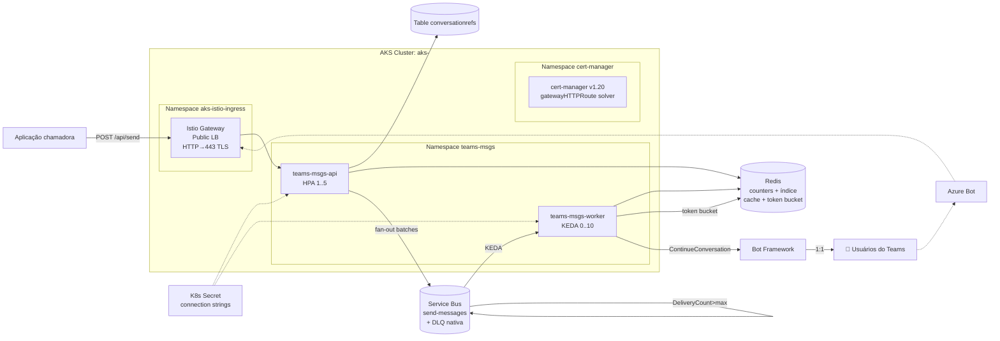

# Arquitetura

Documento detalhado da stack `.NET 8 + AKS + Service Bus + Redis + Table Storage + Istio + connection strings`.

## Visão geral



## Componentes por camada

### Ingress / TLS

- **AKS managed Istio mesh** (`az aks mesh enable`) — sidecar injection no namespace `teams-msgs` via label `istio-injection: enabled`.
- **AKS managed Istio ingress gateway external** (`az aks mesh enable-ingress-gateway`) — provê um `Deployment` + `Service LoadBalancer` no namespace `aks-istio-ingress`.
- **Kubernetes Gateway API CRDs** (v1.2.0) — `Gateway`, `HTTPRoute`, etc. Padrão K8s sucessor do `Ingress`.
- **cert-manager v1.20.2** + **ClusterIssuer** `letsencrypt-prod` com solver `http01.gatewayHTTPRoute`. Emite cert para a `Certificate` `teams-msgs-gw-tls` em `aks-istio-ingress`. `Gateway` referencia esse Secret para terminação TLS.
- DNS label `teams-msgs-dotnet` atribuído ao Public IP do LB do Istio Gateway → resolve para `teams-msgs-dotnet.brazilsouth.cloudapp.azure.com`.

### Compute

- **`teams-msgs-api` Deployment** — pod único por default. `HPA` por CPU (1..5 réplicas, target 70%). Service tipo `ClusterIP` (Istio Gateway faz o ingress).
- **`teams-msgs-worker` Deployment** — `replicas: 0` no manifest. `KEDA ScaledObject` com trigger `azure-servicebus` autenticado por `TriggerAuthentication` (`secretTargetRef` → `ServiceBus__ConnectionString` do Secret). Escala 0..10.
- **`HPA` keda-hpa-teams-msgs-worker** — gerenciado pelo KEDA, métrica externa `s0-azure-servicebus-send-messages`.
- **System node pool** `sys2` — VMs `Standard_D2ds_v5` com **OS disk efêmero** (sem managed disk → economia, inclusive com o cluster parado). Imagens vêm de um **ACR compartilhado** (RG externo da subscription; kubelet recebe `AcrPull` via módulo Bicep cross-RG `acr-rbac.bicep`).

### Data plane

#### Table Storage (fonte de verdade dos refs)

| Tabela | PartitionKey | RowKey | Conteúdo |
|---|---|---|---|
| `conversationrefs` | `refs` | `base64url(conversationId)` | `refJson` (JSON serializado do `ConversationReference`) |

A tabela `conversationrefs` é a única tabela. As tabelas `jobs` e `sentmarks` da versão anterior **saíram**: os counters foram para o Redis e a dedup para o `messageId` nativo do Service Bus.

#### Redis (4 papéis)

`RedisJobTracker` + `RedisTokenBucket` (StackExchange.Redis) cobrem os mesmos papéis da referência TS:

| Papel | Estrutura | Operação |
|---|---|---|
| **Job counters** | hash `job:{id}` | `HMSET` (meta) + `HINCRBY` (`sent`/`failed`) atômico, `EXPIRE 24h`; `status` derivado de `(sent+failed) ≥ total` |
| **Índice de refs** | set `refs:active` | `SADD`/`SREM` no save/remove; `SCARD` para o total O(1) |
| **Cache de payload** | hash `job:{id}` (campos `message`/`messageType`) | `GetMessageAsync` lê o payload resolvido; `IMemoryCache` local como L1 (5 min) |
| **Rate limit** | string `{key}` (token bucket) | script Lua `TOKEN_BUCKET_LUA` atômico, recarga proporcional ao tempo |

```csharp
// HINCRBY atômico — sem contenção de ETag, sem sharding
await db.HashIncrementAsync($"job:{jobId}", field, 1);
```

> A contenção de ETag que motivava o sharding de 16 shards do Table Storage **deixa de existir**: o `HINCRBY` do Redis é atômico e O(1), suportando a concorrência dos workers KEDA sem registro "quente".

#### Idempotência — dedup nativa do Service Bus

Cada mensagem leva `messageId = {jobId}:{md5_hex(refRowKey)}:{repeatIndex}` (`ServiceBusMessageId.Compute`). A fila é criada com `requiresDuplicateDetection = true` e janela `PT10M`, então reenvios do mesmo `messageId` são descartados pelo broker. Não há tabela `sentmarks` nem escrita extra por mensagem.

### Service Bus

- Namespace **Standard**, fila `send-messages` com `requiresDuplicateDetection=true`, `deadLetteringOnMessageExpiration=true`, `maxDeliveryCount`, `lockDuration=PT5M`.
- Producer (`ServiceBusSendQueue`): `EnqueueBatchAsync` agrega refs em `ServiceBusMessageBatch` (buffer de 500 no fan-out).
- Consumer (`ServiceBusSendQueueReceiver`): modo **PeekLock** — `Complete` no sucesso/permanente, `Abandon` no transiente (broker reentrega e, ao exceder `maxDeliveryCount`, manda para a **DLQ nativa** `$DeadLetterQueue`).

Limites relevantes:
- 256 KB por mensagem (Standard) — comporta AdaptiveCards grandes
- Dedup nativa e DLQ nativa (sem poison queue manual)

### Identidade / Auth (connection strings)

```
K8s Secret teams-msgs-secrets
  ├── Storage__ConnectionString      → TableClient (conversationrefs)
  ├── ServiceBus__ConnectionString   → ServiceBusClient (producer/consumer) + KEDA
  └── Redis__ConnectionString        → ConnectionMultiplexer (counters/index/cache/bucket)
```

Sem Workload Identity, sem UAMI, sem federated credentials, sem RBAC de data plane. API e Worker leem as connection strings do `Secret` (variáveis `Storage__`/`ServiceBus__`/`Redis__ConnectionString`). O único role assignment que permanece é o `AcrPull` do kubelet no ACR compartilhado (módulo `acr-rbac.bicep`).

### Rate limit (token bucket Redis)

`RedisTokenBucket.AcquireTokenAsync` roda no hot path do worker, **antes** de `ContinueConversationAsync`. Um único bucket global (script Lua atômico) é compartilhado por todos os pods — diferente do limite por-pod do EnvoyFilter anterior.

```lua
-- TOKEN_BUCKET_LUA (resumo): recarrega tokens proporcional ao tempo decorrido,
-- consome 1 se houver, retorna o tempo de espera caso contrário
local tokens = math.min(capacity, stored + elapsed * ratePerSec)
if tokens >= 1 then tokens = tokens - 1; return 0 else return wait end
```

A função pura `RedisTokenBucket.Step` (recarga/consumo) é coberta por `TokenBucketTests`. **Vantagem**: limite global real (não aproximado por número de réplicas).

### Observabilidade

- **Container Insights** (Log Analytics workspace `log-<seu-workspace>`) coleta stdout/stderr de todos os pods e métricas do nó.
- **Daily cap 25 MB** configurado para conter custo durante PoC. Status visível em `workspaceCapping.dataIngestionStatus`.
- **KEDA operator logs** em `kube-system/keda-operator` mostram quando o azure-servicebus scaler consegue ou não ler a profundidade da fila.

## Diferenças vs versão TS

Após a reversão, o **data plane é equivalente ao da referência TS** (Service Bus + Redis + connection strings). As diferenças restantes são de **plataforma de hospedagem**:

| Categoria | TS (referência) | .NET PoC |
|---|---|---|
| Mensageria | Service Bus (batches, dedup nativa, DLQ) | **Igual** |
| Dedup | `messageId` nativo SB | **Igual** (`{jobId}:{md5(rowKey)}:{repeat}`) |
| DLQ | SB DLQ automática | **Igual** (DLQ nativa por `maxDeliveryCount`) |
| Rate limit | Redis Lua bucket global | **Igual** (`RedisTokenBucket`) |
| Counters | Redis HINCRBY (atômico) | **Igual** (`RedisJobTracker`) |
| Índice de refs | Redis SCARD | **Igual** |
| Cache msg | Redis HMSET | **Igual** + `IMemoryCache` L1 local 5 min |
| Auth (Storage/SB/Redis) | Connection string | **Igual** (K8s Secret) |
| Refs (fonte de verdade) | Table Storage | **Igual** |
| Scale-to-zero compute | ACA KEDA | AKS KEDA (control-plane sempre on) |
| Ingress | ACA built-in | Istio Gateway + cert-manager Let's Encrypt |
| Auth ao Bot Framework | App ID + password | Mesmo (SingleTenant App Registration) |
